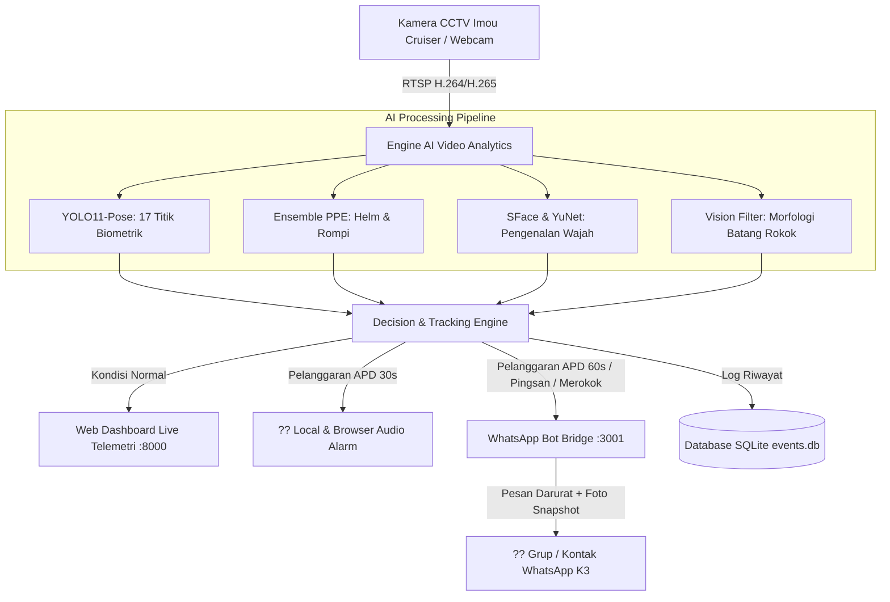

# ? AI K3 Electrical Room Monitoring & Safety Alert System

Sistem Pemantauan Cerdas Keselamatan Kerja (K3) berbasis AI Video Analytics untuk Ruang Elektrikal & Switchgear tegangan tinggi menggunakan CCTV Imou Cruiser / RTSP stream.


---

## ?? Fitur Utama Sistem

1. **?? Deteksi APD K3 Lengkap (Ensemble Multi-Model):**
   - Mendeteksi Helm Keselamatan (*Safety Helmet*) & Rompi K3 (*Safety Vest / Wearpack*) multi-warna (Orange, Stabilo Lime, Hijau Neon).
   - Filter biometrik fluoresensi & saturasi tinggi untuk mencegah *false positive* pada pakaian sipil biasa.
2. **?? Pengenalan Wajah & Pendaftaran Otomatis (*Face Recognition*):**
   - Ekstraksi fitur wajah biometrik 128-D (*OpenCV SFace & YuNet*).
   - Pendaftaran langsung dari tangkapan layar kamera (*Live Snapshot Registration*) atau unggah foto.
3. **?? Deteksi Aktivitas Merokok (*Smoking Action Recognition*):**
   - Proyeksi biometrik gestur tangan-ke-mulut (*YOLO11-Pose*) dipadukan dengan analisis computer vision kontur batang rokok pada area bibir.
4. **?? Deteksi Orang Pingsan / Jatuh (*Man-Down Emergency Alert*):**
   - Analisis kemiringan tulang belakang (*Spine & Neck Angle*) $\theta \ge 38^\circ$ dengan diferensiasi postur duduk (*sitting vs fallen*).
5. **?? Alarm Suara Peringatan Bahasa Indonesia:**
   - Suara peringatan otomatis saat tidak memakai APD $\ge 30\text{ detik}$ atau saat merokok.
   - Tombol on/off suara dapat dikontrol langsung dari dashboard web.
6. **?? Integrasi WhatsApp Bot & Pengiriman Foto Otomatis:**
   - Sambungkan bot WhatsApp via **Scan Barcode QR Web** (tanpa API berbayar).
   - Pengiriman foto snapshot otomatis untuk: Pelanggaran APD $\ge 1\text{ menit}$, Orang Pingsan, Aktivitas di ER $> 5\text{ menit}$, dan Merokok.
   - Fitur pemilihan grup WhatsApp langsung dari dropdown list.
   - Jeda anti-spam 1 jam (3600 detik) untuk violator yang sama.
7. **?? Dukungan CCTV PTZ Auto-Tracking (Imou Cruiser):**
   - Siap terhubung ke kamera Imou Cruiser / Dahua PTZ via RTSP stream dan kontrol rotasi motorik.

---

## ?? Arsitektur Sistem



---

## ? Instalasi Cepat di PC Baru (1-Click Setup)

Panduan instalasi langkah-demi-langkah lengkap tersedia di file **[INSTALLATION_GUIDE.md](INSTALLATION_GUIDE.md)**.

### Ringkasan Cepat:
1. **Unduh / Clone Repository:**
   ```bash
   git clone <URL_REPO_ANDA>
   cd imou-electrical-monitor
   ```
2. **Jalankan Installer:**
   - Klik 2 kali file **`install.bat`**
   - Tunggu hingga selesai.
3. **Jalankan Aplikasi:**
   - Klik 2 kali file **`start.bat`**
   - Buka browser di **`http://127.0.0.1:8000`**

---

## ?? Struktur Direktori

```text
imou-electrical-monitor/
??? models/                     # Bobot Model AI (YOLO11-Pose, PPE, Face SFace)
??? static/                     # Frontend Web Assets (CSS, JS, Audio MP3)
??? templates/                  # Template HTML Web Dashboard
??? tests/                      # Unit Tests (32 Pengujian Otomatis)
??? whatsapp-bridge/            # Microservice Baileys Node.js WhatsApp Bot
??? app.py                      # FastAPI Backend Server
??? detector.py                 # Core AI Video Analytics Pipeline
??? config.py                   # Konfigurasi & Ambang Batas Deteksi
??? notifier.py                 # Manajemen Notifikasi & Snapshot WhatsApp
??? faces.py                    # Engine Pengenalan Wajah OpenCV SFace
??? audio.py                    # Pemutar Suara Alarm Lokal
??? storage.py                  # Database Event SQLite
??? install.bat                 # 1-Click Installer untuk Windows
??? start.bat                   # 1-Click Launcher Sistem
??? stop.bat                    # 1-Click Shutdown Layanan
??? requirements.txt            # Dependensi Python
??? INSTALLATION_GUIDE.md       # Panduan Instalasi Lengkap
```

---

## ?? Pengujian Sistem (Unit Testing)

Untuk menjalankan seluruh 32 unit test:
```bash
venv\Scripts\python.exe -m unittest discover tests
```
Semua 32 test case mencakup:
- Deteksi Helm & Rompi K3 (termasuk wearpack hijau neon)
- Deteksi Gestur & Visual Merokok
- Deteksi Postur Jatuh/Pingsan vs Duduk
- Verifikasi Alert Notifikasi WhatsApp & Jeda Anti-Spam
